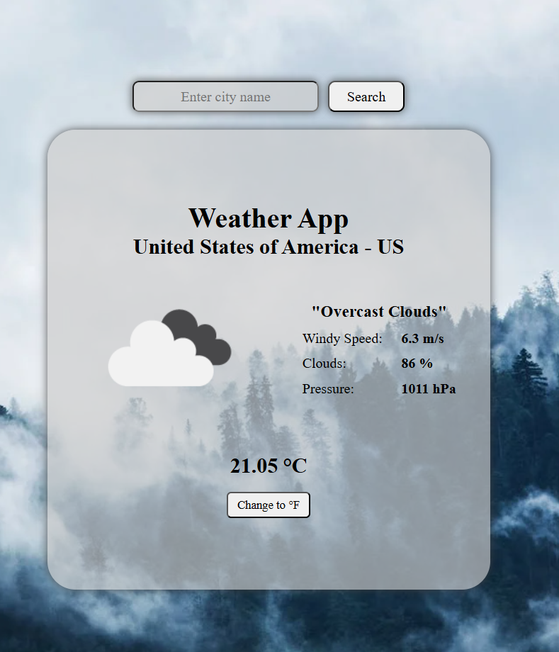

# 🌦 Welcome to “WeatherApp” 🌤

## Discover the Weather in Real Time

Our app provides you with up-to-date information about the weather anywhere in the world. Whether you're planning a trip, a hike, or just want to be prepared for the day, WeatherApp has everything you need.

## Main Features:

1. Real-Time Forecast: Get accurate and up-to-date data on humidity, wind speed and temperature in degrees Fahrenheit and degrees Celsius.
2. Search by Location: Enter the name of a city or country, and WeatherApp will show you the information for that place.

## How does it work?

WeatherApp uses a global network of weather stations to provide you with accurate and reliable information.  
🌦️☀️❄️  
Try WeatherApp today and stay informed about the weather! 
